# TableManners

TableManners, is a browser extension just for the `<table>`s on the websites.

TableManner，是一款服务于网页中 `<table>` 表格的浏览器插件。

⚠️ This project is still under developing now, although it may just works.

-> Chrome Extension Structure <-

- Co-Author: [lemongranule](https://github.com/lemongranule)

## Feature List

- [x] Filter rows by keywords
- [x] Recognize tables automatically
- [x] Chrome supported
- [ ] Safati supported
- [ ] Firefox supported
- [ ] Using TypeScript

## License

- MIT License
